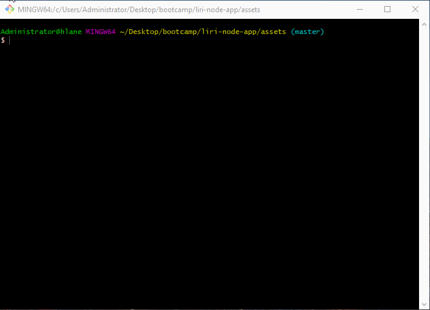

# LIRI Bot Project

LIRI is an app designed to use the local console to search:

1. Spotify for songs
2. Bands in Town for concerts
3. OMDB for movies.

# Technologies 

Node-Spotify-API
Axios
Moment
DotEnv

# TRY IT OUT

Open up your console and clone this repo - 

Be sure to run 'npm i' to install all of the necessary packages. 

Once you are in the 'asset' directory of the project, run the following commands to yield the different results:

1. node liri.js concert-this '<artist name here>' - This command will display the dates and locations of your input artist's concerts
2. node liri.js spotify-this-song '<song name here>' - This will display the information regarding the song, as well as a link to it 
3. node liri.js movie-this '<insert movie name here>' - This will display the information of the movie
4. node liri.js do-what-it-says - This command will render the information from the 'random.txt' file
  
# View a demonstration here: 

